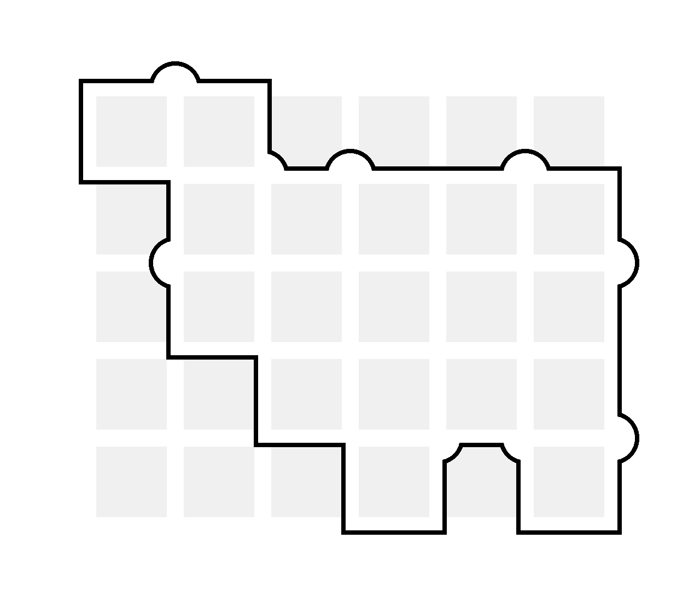
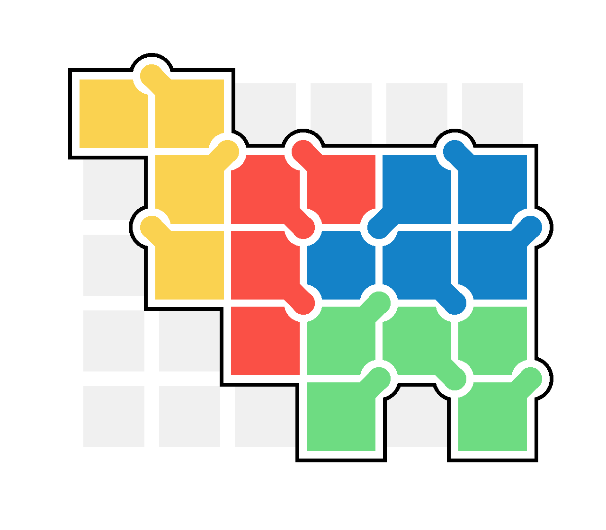
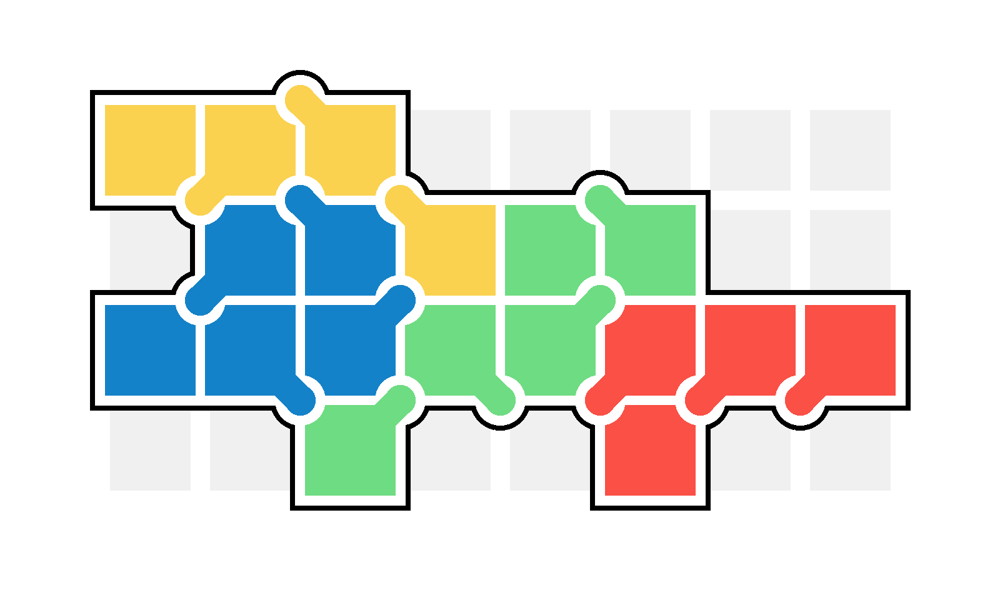
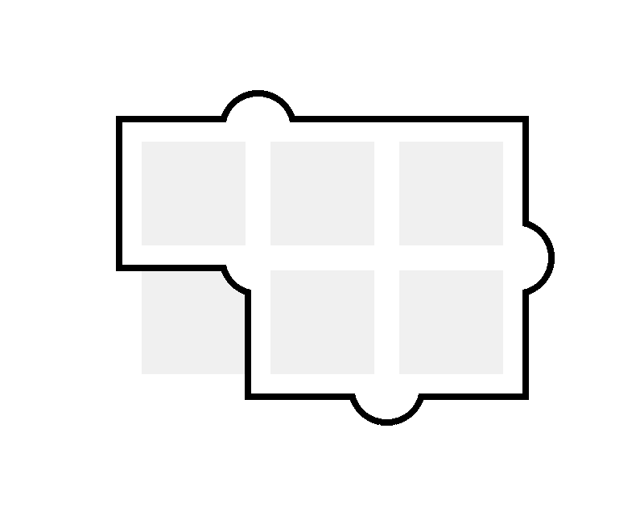
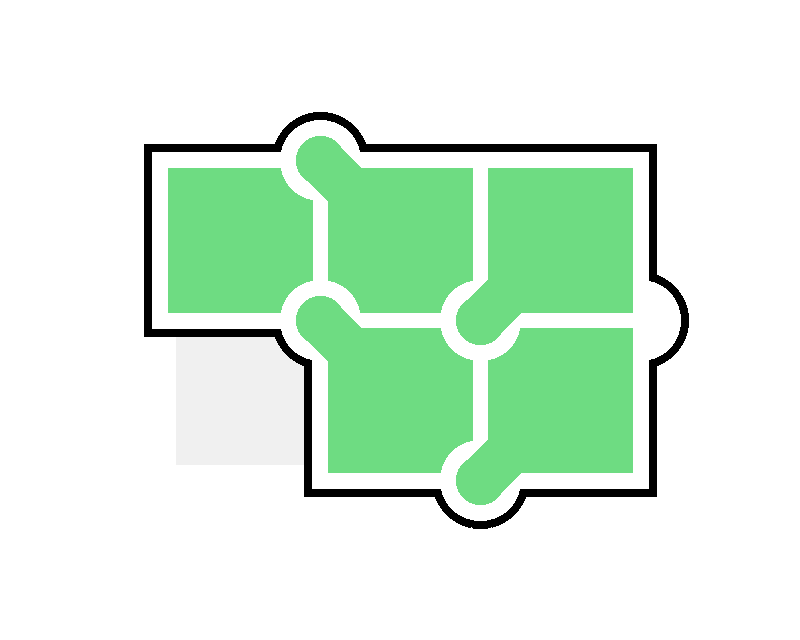
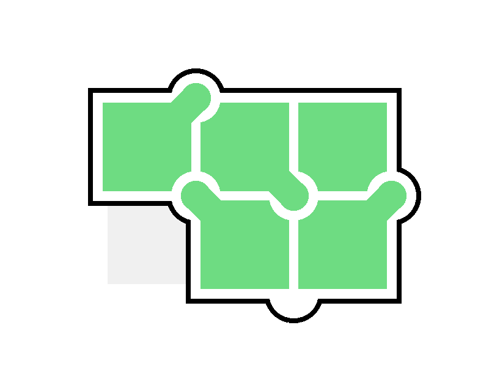

# SKEWBITS
Solver for Make Anything's SKEWBITS puzzles

Created by Darci Peoples (https://linktr.ee/darcipeoples)

Make Anything's SKEWBITS:
* YouTube video: https://www.youtube.com/watch?v=j_jYnhOX49g
* 3D printing files: https://than.gs/m/949147



<br/>



## How to run it
### On replit.com
If you don't want to install Python & git on your computer, you can simply 'Fork' and 'Run' this REPL from within the browser: https://replit.com/@DarciPeoples/SKEWBITS-Solver

### On your computer
Clone the GitHub repo, install Python, and run the program
```
python3 solver.py
```

## Program options
### Arguments
When running the program, you must specify:
1. Which `.txt` file in the `input/` folder to read from.
2. Whether you want to find all solutions the puzzle or just the first one
  - Note: Finding all solutions for each of the 001-025 SKEWBITS puzzles takes less than 30 seconds on my laptop. On REPL, it's up to 3.5 minutes for difficult puzzles like 020, but often less for the others.

### How to set the arguments
There are two ways to specify the arguments:
1) **Question & Answer:** If you don't pass any command line arguments (e.g. just hit 'Run' in REPL), the program will ask you two questions to speciy the arguments.
2) **Command Line Arguments:** If you don't want to type your input parameters each time you run the program, you can pass them in as command line arguments (in REPL, this is in the "Shell" tab). Run `python3 solver.py -h` to see all options. For example, this command will find all solutions to the puzzle specified in `input/001.txt`: `python3 solver.py 001.txt --solve-all`

## Make your own puzzle
To run the program using your own puzzle, you can add to or modify the `.txt` files inside of the `input/` folder. If making a brand new puzzle, it can help to copy the contents of `input/grid.txt` as a starting point.

Outputs of the program go into the `output/<name of your puzzle>/` folder.

## (Tiny) Example
*I'm using a tiny grid & just the green piece for this example. For now, the program requires that you use all pieces & fill all cells in the grid (so you needs to have 18 available  (aka 'X') cells).*

### Create a `.txt` file in `input/`
For example, copy `input/grid.txt` into `input/example.txt`
```
.-.-.-.
| | | |
.-.-.-.
| | | |
.-.-.-.
```

### Mark all available cells with an 'X'
*At this time, the program can only solve puzzles with exactly 18 available cells.*
```
.-.-.-.
|X|X|X|
.-.-.-.
| |X|X|
.-.-.-.
```

### (Optional) Remove borders from unused cells
```
.-.-.-.
|X|X|X|
.-.-.-.
  |X|X|
  .-.-.
```

### Mark available dots on the outline with 'O'
Mark all available dots (notches) on the outside of the outline using 'O'. The program will automatically add 'O's that are in the middle of the shape for you, so you don't have to add those.
```
.-O-.-.
|X|X|X|
.-O-.-O
  |X|X|
  .-.-.
```

### Double-check the outline in `output/`
Check that the outline generates as expected.

```
python3 solver.py example.txt --solve-all
```

`output/example/example-outline.png`:



### Run the program to solve the puzzle
Run the program (use `--solve-all` if you want all solutions or answer Yes to that prompt).

```
python3 solver.py example.txt --solve-all
```

### Check the solution(s)

**Solution images**

For example, `output/example/solution-images/`




**Solution json**

The program also outputs a (for example) a `<your puzzle>-solutions.json` file that stores the location, orientation, color, etc. of the pieces on the board as well as the number of solutions and how long they took to find. This is helpful for testing program changes without recomputing the solutions.

## FAQ
### No solutions found
If the program says it's unable to find any solutions, the puzzle may be impossible. You may need to check if the outline generated as you hoped. If it has, it's possible that your puzzles has more or less than 18 cells, which isn't allowed. Or your puzzle may have an impossible dot pattern on the outline. To fix this, you could add more available dots to the outside of the perimeter and then chip away.